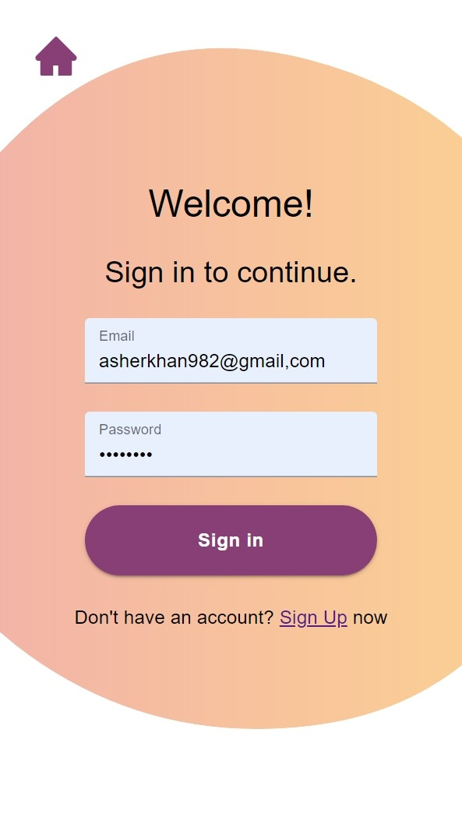
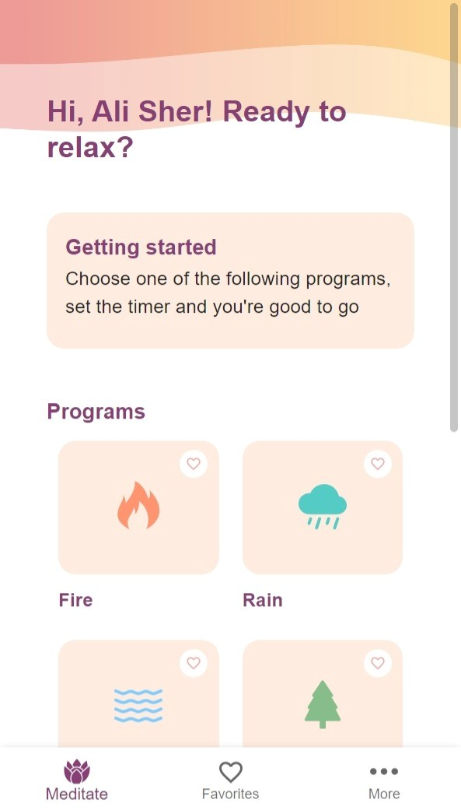
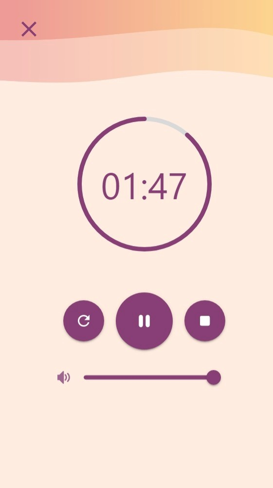

<a name="readme-top"></a>

[![Contributors][contributors-shield]][contributors-url]
[![Forks][forks-shield]][forks-url]
[![Stargazers][stars-shield]][stars-url]
[![Issues][issues-shield]][issues-url]
[![MIT License][license-shield]][license-url]
[![LinkedIn][linkedin-shield]][linkedin-url]

<!-- PROJECT LOGO -->
<br />
<div align="center">
  <a href="https://github.com/alisherkhan98/react-meditation-app">
    
  </a>

<h3 align="center">Medit8</h3>

  <p align="center">
    Take a break. Meditate
    <br />
    <br />
    <a href="https://github.com/alisherkhan98/react-meditation-app"><strong>Explore the docs »</strong></a>
    <br />
    <br />
    <a href="https://dashing-biscuit-678c3e.netlify.app/">View Demo</a>
    ·
    <a href="https://github.com/alisherkhan98/react-meditation-app/issues">Report Bug</a>
    ·
    <a href="https://github.com/alisherkhan98/react-meditation-app/issues">Request Feature</a>
  </p>
</div>
<br />
<br />
<!-- TABLE OF CONTENTS -->
<details>
  <summary>Table of Contents</summary>
  <ol>
    <li>
      <a href="#about-the-project">About The Project</a>
      <ul>
        <li><a href="#built-with">Built With</a></li>
      </ul>
    </li>
    <li>
      <a href="#getting-started">Getting Started</a>
      <ul>
        <li><a href="#prerequisites">Prerequisites</a></li>
        <li><a href="#installation">Installation</a></li>
      </ul>
    </li>
    <li><a href="#usage">Usage</a></li>
    <li><a href="#contributing">Contributing</a></li>
    <li><a href="#contact">Contact</a></li>
  </ol>
</details>
<br />
<!-- ABOUT THE PROJECT -->

## About The Project





=

<p align="right">(<a href="#readme-top">back to top</a>)</p>

### Built With

- [![ReactRouter][reactrouter-shield]][reactrouter-url]
- [![EmailJs][emailjs-shield]][emailjs-url]
- [![Firebase][firebase-shield]][firebase-url]
- [![ReactJs][react-shield]][react-url]
- [![Material UI][mui-shield]][mui-url]
- [![Redux][redux-shield]][redux-url]
- [![Howler][howler-shield]][howler-url]

<p align="right">(<a href="#readme-top">back to top</a>)</p>

<!-- GETTING STARTED -->

## Getting Started

To get a local copy of the project up and running follow these simple example steps.

### Prerequisites

- Install [Node.js](https://nodejs.org/it/download)
- npm
  ```sh
  npm install npm@latest -g
  ```

### Installation

1. Clone the repo
   ```sh
   git clone https://github.com/alisherkhan98/react-meditation-app.git
   ```
2. Install NPM packages
   ```sh
   npm install
   ```
3. Now if you want to open a live server to start developing type this in your terminal:

   ```sh
   npm start
   ```

   otherwise if you want to build the final files bundeled with webpack type

   ```sh
   npmm run build
   ```

   This will create a new dist folder with the built files in it

<p align="right">(<a href="#readme-top">back to top</a>)</p>

<!-- USAGE EXAMPLES -->

## Usage

The app is very basic, if you are not signed in you can do it, you can sign up or you can sign in as a guest to try the features.

Once you are signed in, in the home page you can see a collection of cards and if you click on any of them a player will appear (the one you see in the screenshots) to play the related sound.

You can add sounds to your favorites list and if you are signed in with a non-anonymous account they will be saved.

<p align="right">(<a href="#readme-top">back to top</a>)</p>

## Error handling

If an error occurs with any of the authentication functions the promise chain is aborted and an alert appears on the top to explain what happened.

<!-- CONTRIBUTING -->

## Contributing

Contributions are what make the open source community such an amazing place to learn, inspire, and create. Any contributions you make are **greatly appreciated**.

If you have a suggestion that would make this better, please fork the repo and create a pull request. You can also simply open an issue with the tag "enhancement".
Don't forget to give the project a star! Thanks again!

1. Fork the Project
2. Create your Feature Branch (`git checkout -b feature/AmazingFeature`)
3. Commit your Changes (`git commit -m 'Add some AmazingFeature'`)
4. Push to the Branch (`git push origin feature/AmazingFeature`)
5. Open a Pull Request

<p align="right">(<a href="#readme-top">back to top</a>)</p>

<!-- CONTACT -->

## Contacts

Email: asherkhan982@gmail.com

My [LinkedIn](https://linkedin.com/in/ali-sher-khan-1331a8205)

Project Link: [https://github.com/alisherkhan98/react-meditation-app](https://github.com/alisherkhan98/react-meditation-app)


<p align="right">(<a href="#readme-top">back to top</a>)</p>

<!-- MARKDOWN LINKS & IMAGES -->
<!-- https://www.markdownguide.org/basic-syntax/#reference-style-links -->

[contributors-shield]: https://img.shields.io/github/contributors/alisherkhan98/react-meditation-app.svg?style=for-the-badge
[contributors-url]: https://github.com/alisherkhan98/react-meditation-app/graphs/contributors
[forks-shield]: https://img.shields.io/github/forks/alisherkhan98/react-meditation-app.svg?style=for-the-badge
[forks-url]: https://github.com/alisherkhan98/react-meditation-app/network/members
[stars-shield]: https://img.shields.io/github/stars/alisherkhan98/react-meditation-app.svg?style=for-the-badge
[stars-url]: https://github.com/alisherkhan98/react-meditation-app/stargazers
[issues-shield]: https://img.shields.io/github/issues/alisherkhan98/react-meditation-app.svg?style=for-the-badge
[issues-url]: https://github.com/alisherkhan98/react-meditation-app/issues
[license-shield]: https://img.shields.io/github/license/alisherkhan98/react-meditation-app.svg?style=for-the-badge
[license-url]: https://github.com/alisherkhan98/react-meditation-app/blob/master/LICENSE.txt
[linkedin-shield]: https://img.shields.io/badge/-LinkedIn-black.svg?style=for-the-badge&logo=linkedin&colorB=555
[linkedin-url]: https://linkedin.com/in/ali-sher-khan-1331a8205
[product-screenshot1]: src/assets/images/screenshot1.jpeg
[product-screenshot2]: src/assets/images/screenshot2.jpeg
[product-screenshot3]: src/assets/images/screenshot3.jpeg
[reactrouter-shield]: https://img.shields.io/badge/-React%20Router-CA4245?style=for-the-badge&logo=reactrouter&logoColor=white
[reactrouter-url]: https://reactrouter.com/en/main
[react-shield]: https://img.shields.io/badge/-React-61DAFB?style=for-the-badge&logo=react&logoColor=black
[react-url]: https://reactjs.org/
[redux-shield]: https://img.shields.io/badge/-Redux-764ABC?style=for-the-badge&logo=redux&logoColor=white
[redux-url]: https://redux.js.org/
[firebase-shield]: https://img.shields.io/badge/-Firebase-FFCA28?style=for-the-badge&logo=firebase&logoColor=black
[firebase-url]: https://firebase.google.com/
[mui-shield]: https://img.shields.io/badge/-Material%20ui-007FFF?style=for-the-badge&logo=mui&logoColor=white
[mui-url]: https://mui.com/
[howler-shield]: https://img.shields.io/badge/-Howler.js-3d342c?style=for-the-badge
[howler-url]: https://www.npmjs.com/package/react-howler
[emailjs-shield]: https://img.shields.io/badge/-emailjs-fca253?style=for-the-badge
[emailjs-url]: https://www.emailjs.com/
